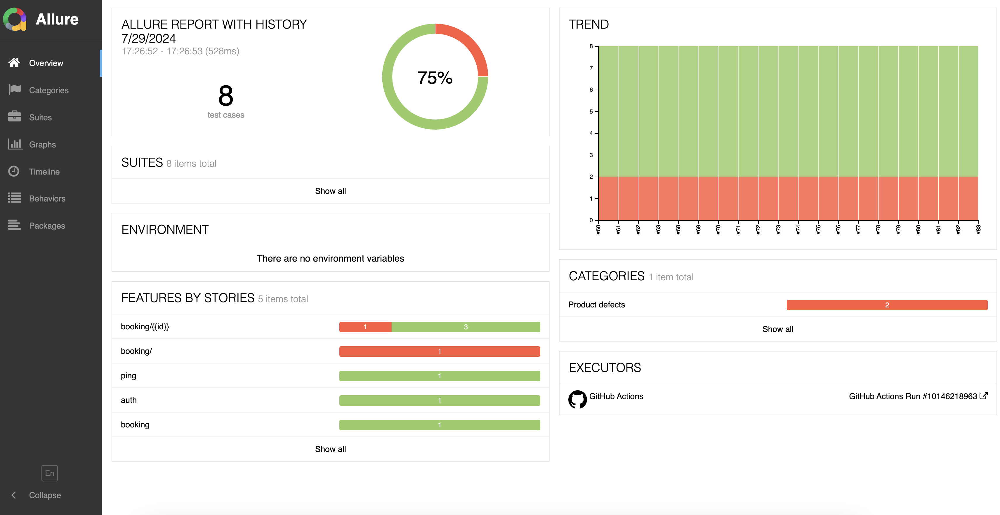
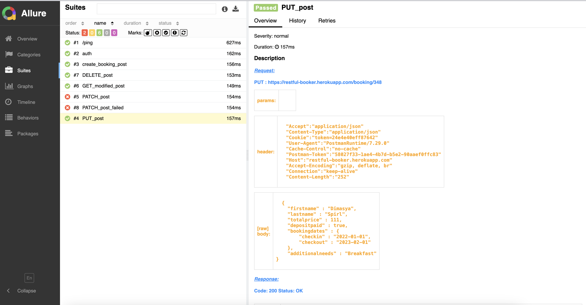
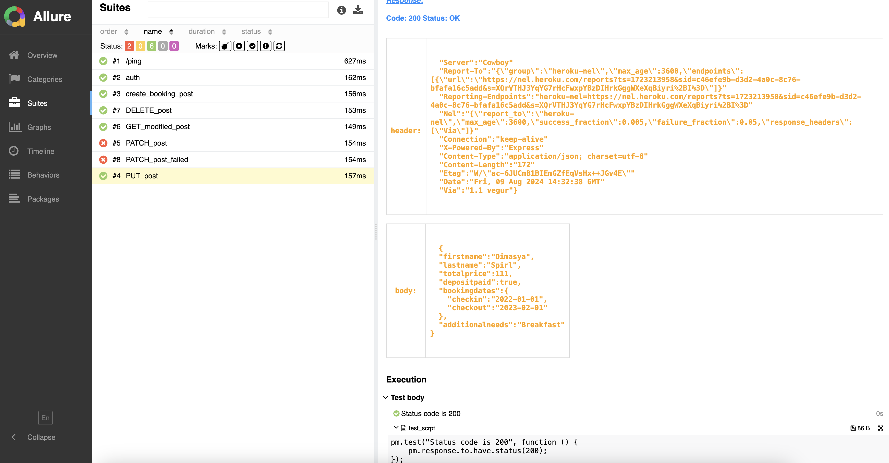
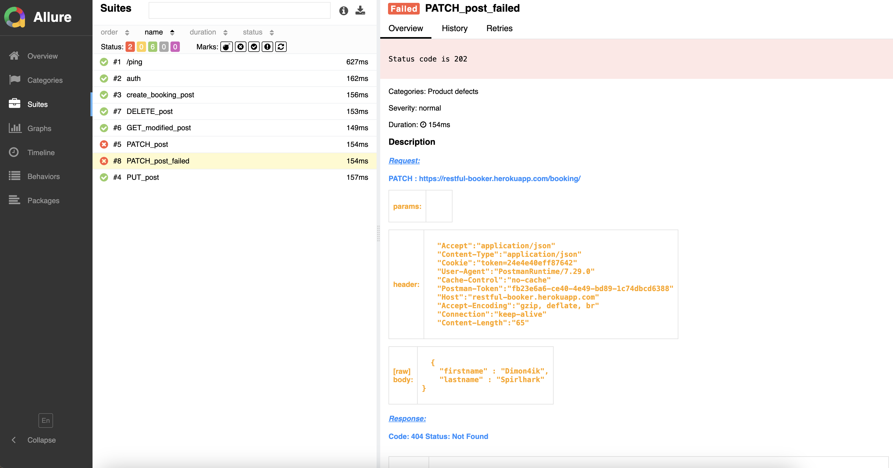

# Postman Collection Run

Этот проект предоставляет возможность интеграции Postman коллекций в процесс непрерывной интеграции (CI), позволяя автоматически запускать тесты API. Результаты выполнения коллекций обрабатываются и представляются в виде детализированного отчета Allure, который содержит полную информацию о каждом запросе, включая его параметры, ответы и возможные ошибки. Это обеспечивает наглядность и удобство при анализе результатов тестирования, позволяя быстро идентифицировать и исправлять проблемы в API.

## Содержание
- [Технологии](#технологии)
- [Требования](#Требования)
- [Установка](#Установка)
- [Запуск](#Запуск)
- [Отчет](#Отчет)

## Технологии
- [Postman](https://www.postman.com/)
- [Newman](https://www.npmjs.com/package/newman/)
- [Allure](https://allurereport.org/)

## Требования
Для установки и запуска проекта, необходим [NodeJS](https://nodejs.org/), [Java](https://www.java.com/) версии 8 или выше.

## Установка

1. Установите Allure-Report

2. Установите npm-пакет с помощью команды:
```sh
npm install -g newman
npm install -g newman-reporter-my_allure.tgz
```

## Запуск

1. Експортируйте вашу Postman Collection и Environment(если он используеться) в папку проекта `pm`

2. Выполните команду для прогона вашей коллекци указав:
```sh
newman run pm/restful-booker.postman_collection.json -e pm/booking_env.postman_environment.json -r my_allure
```
- `pm/restful-booker.postman_collection.json` => файл коллекци в папке `pm`
- `pm/booking_env.postman_environment.json` =>  файл environment в папке `pm`
- `my_allure` => Имя репортера 
- Будут сформированы файлы для отчета, по результатм выполнения коллекци в папку `allure-results`

3. Выполните команду для формирования отчета в папку `allure-report`:
```sh
allure generate
```
4. Выполните команду что бы открыть отчет в браузере:
```sh
allure serve
```

## Отчет







## Зачем был разработан этот проект?
Postman — это удобный и интуитивно понятный инструмент, который стал неотъемлемой частью повседневной работы многих разработчиков и тестировщиков. Благодаря своей простоте и гибкости, Postman стал незаменимым инструментом для тестирования и автоматизации API, позволяя добавлять различные типы проверок для выполняемых запросов. С помощью этого проекта вы сможете легко запускать готовые коллекции Postman и получать детализированные отчеты, которые помогут глубже понять результаты тестирования и быстрее находить и исправлять возможные проблемы. Это делает процесс тестирования не только эффективным, но и максимально удобным.

